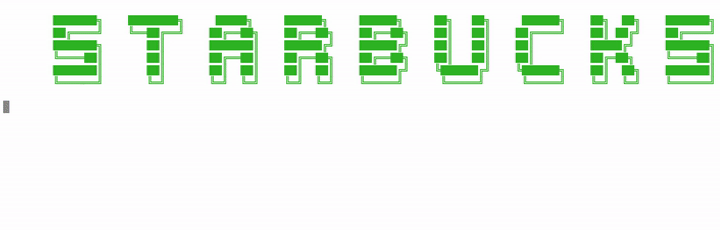

<h1 align="center">Starbucks w/ A & B ☕️ </h1>

  A <code>Ruby</code> CLI application for ordering beverages with the intentions of networking with Annie and Baruch

  Built with ✨ by
  <a href="https://github.com/bigfishh">Annie Zheng</a> and
  <a href="https://github.com/bphillips95"> Baruch Phillips</a>
  

  

## Features 
- Animated welcome display along with background "elevator" music and audio
- Sign in/sign up option with authenticated password
- Includes fun navigatable menus and choice options such as
  - Break your computer 
  - Get caffinated
  - Starbucks locations (pre-seeded data)
  - Beverage options
- Full CRUD capabilities for users such as updating username/password and deleting account

## Tech Stack
This web app makes use of the following:
- Ruby [2.6.1]
- SQLite3 [~> 1.4] - Database
- Sinatra-activerecord - Gem that extends Sinatra with ActiveRecord helper methods and Rake tasks
- TTY::Prompt - Gem that provides easy option selection
- Colorize - Gem for colorizing text using ANSI escape sequences

## Installing
- Clone this repo to your local machine `git clone <this-repo-url>`.
- run `cd StarbucksApp`.
- run `bundle install` to install required dependencies
- run `rake db:migrate` to create tables into the database.
- run `rake db:seed` to create seed data.
- run `ruby bin/run.rb` to run the app.
